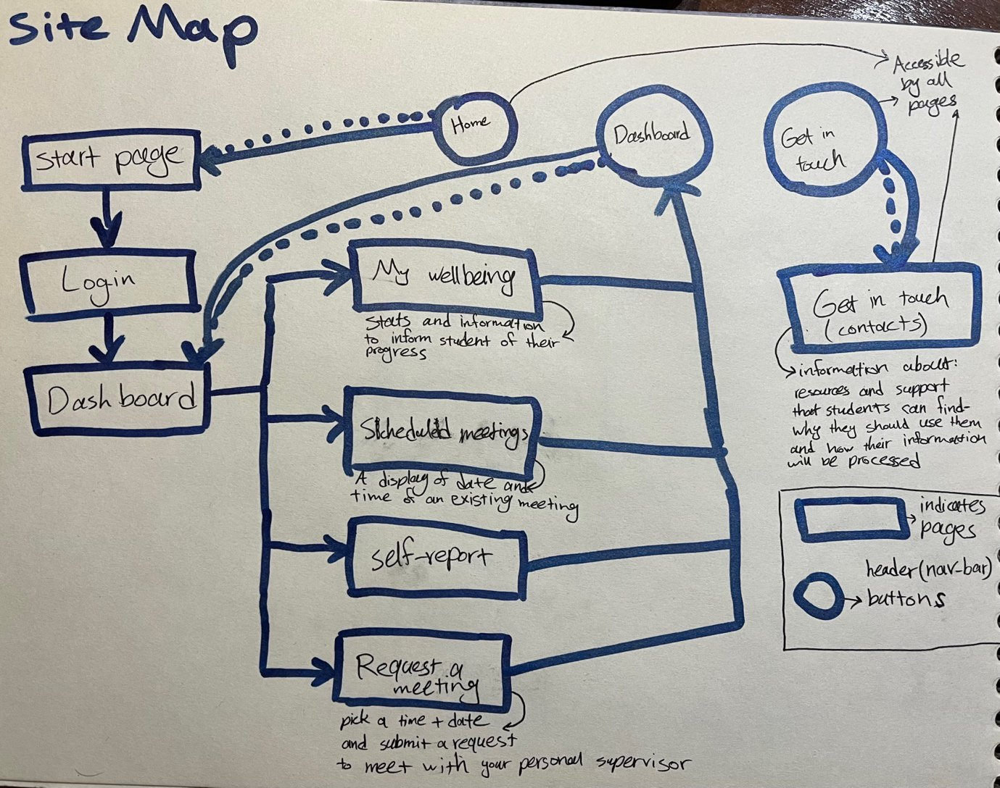
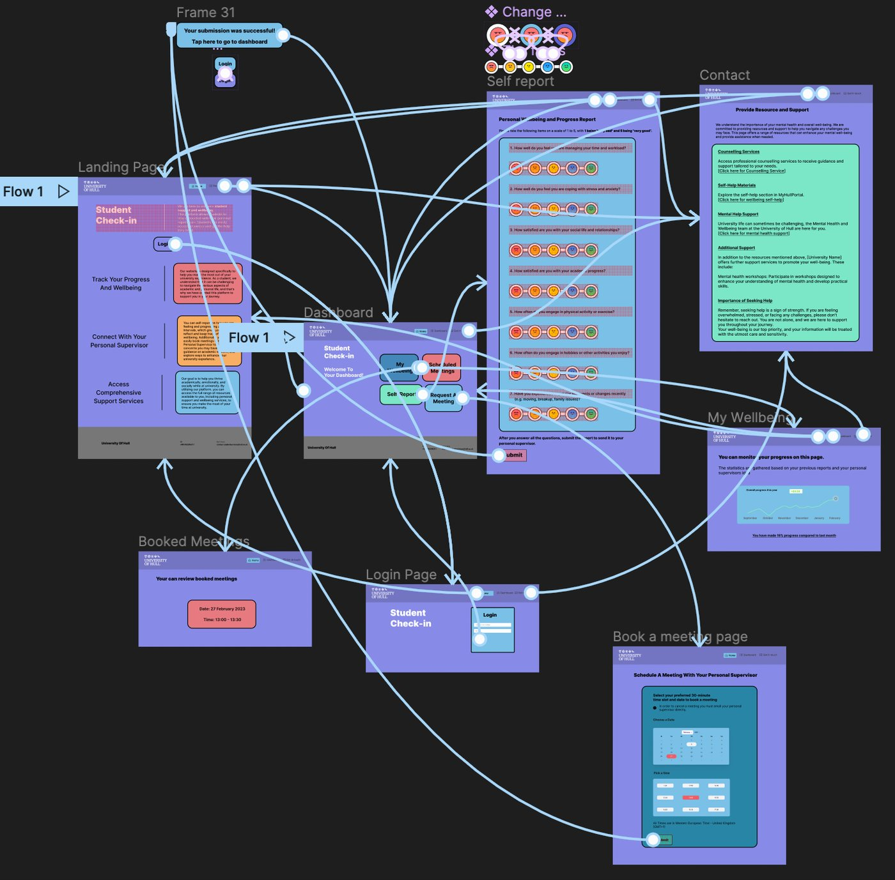
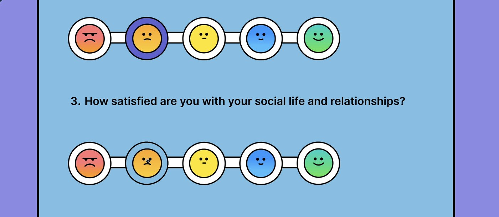
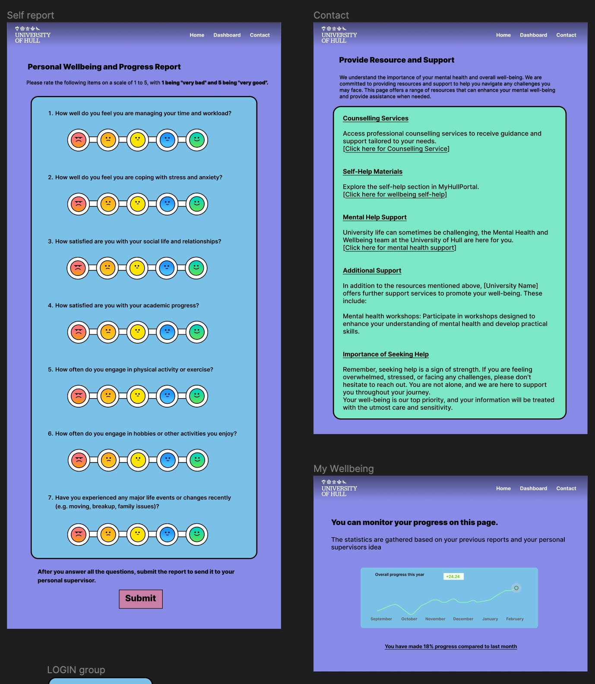
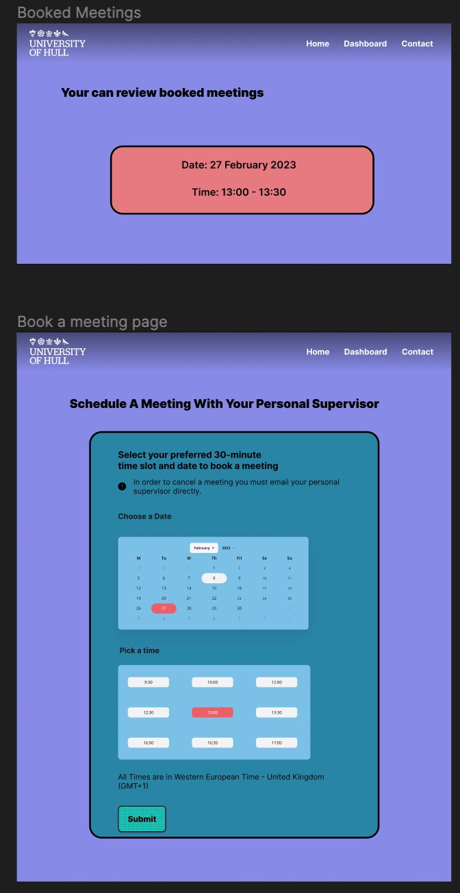

# Personal Supervisor / Student Wellbeing System

A concept for a platform where students self-report on their wellbeing and stay in touch with their personal supervisor. Check-ins, meeting booking, a support resources hub.

## Research: cognitive walkthroughs

Before designing anything myself, I evaluated two existing products, Discord and Crunchyroll, against Nielsen's usability heuristics. I noted specific issues, like missing confirmation feedback and unclear icon labelling. That became my checklist for the design.

## Sketching the structure first

Hand-sketched site map. Worked out the navigation before touching any visual design.

## Figma prototype

Turned the site map into a clickable prototype: landing page, login, dashboard, self-report, support/contact, meeting booking, and a wellbeing progress view.

A few things I focused on:

- **Self-report page:** a 1–5 face-rating scale instead of plain numbers. Quicker to read at a glance.
- **Feedback on actions:** hover states, colour changes, confirmation pop-ups. Always clear what just happened.
- **Consistent nav:** same structure on desktop and the mobile hamburger menu.

The 1–5 face-rating scale used on the self-report question.

## Key screens

Self-report (face-rating scale), support resources, and personal wellbeing progress tracker.

Booked meetings and the booking flow, with calendar and time-slot picker.

## User testing

Tested the support/resources flow on the prototype with a real user, after going through an ethics checklist. Made two fixes based on what came up.

This one stayed a Figma prototype. I didn't take it to code.
