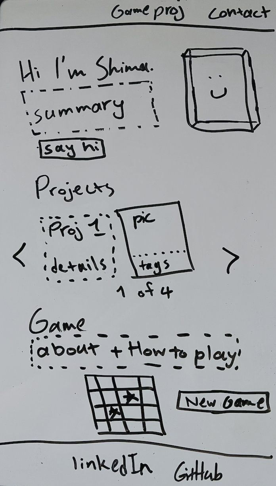

# Personal Website & Connect Four Game

My own site, built by hand with no frameworks. Includes a playable Connect Four game against an AI opponent ("Sir Chipotle"), using minimax, with easy and hard modes plus a two-player mode.

## What's on it

A single-page layout: intro, project showcase, the game, contact footer. Three projects with short summaries and tech tags. A Connect Four board with live score tracking and turn indicators. Fully responsive, hand-written CSS. No framework, no component library.

## Starting point: the wireframe

Sketched the layout by hand before writing any code.