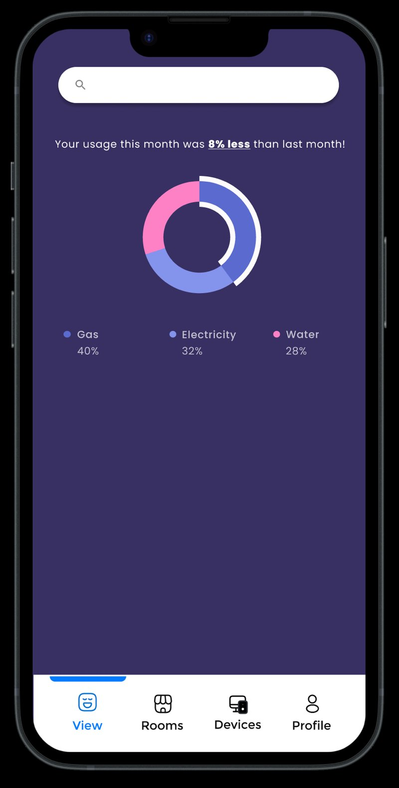
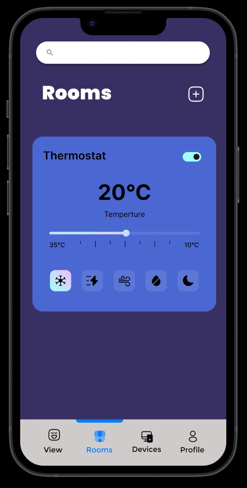

# Home Automation App Concept

Another UX case study, this one on smart-building control: rooms, lights, thermostat, locks. Plus a usage dashboard that breaks energy use down by gas, electricity, and water.

Figma screens: usage dashboard (gas/electricity/water split), and per-room device controls with a thermostat slider and preset modes.

 
